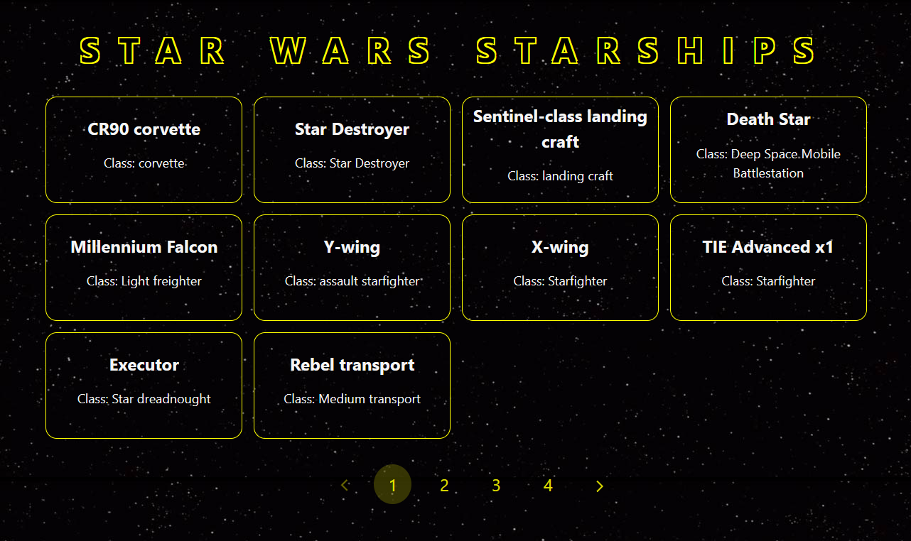

<h1 align="center">Welcome to StarWars_Lab!</h1>

  
  
  

> Per Scholas - Week 12 - React: Displaying API Data - Assignment: starWars_Lab

> In this assignment, I consumed the [Star Wars API (SWAPI)](https://swapi.dev/) and used it to display the starships. Since the API uses pagination, I used pagination to enable the user to view all starships, not just the first page of starships.

## Demo

[demo link](https://starwars-lab.onrender.com)

### 🏠 [Homepage](https://github.com/DrAcula27/starWars_Lab#readme)

## Author

👤 **Danielle Andrews**

- Github: [@DrAcula27](https://github.com/DrAcula27)
- LinkedIn: [@daniellerandrews](https://linkedin.com/in/daniellerandrews)

## Project Details

**Styling in this lab is secondary to completing the functionality**

### Minimum Viable Product (MVP)

1. Research documentation of SWAPI Links to an external site. to find the endpoint for the `starships` resource.
1. Create a route in `server.js` to call the API.
1. Use named exports to expose AJAX functionality as needed, e.g., `export function getAllStarships() {...}` to obtain all starships.
1. Obtain all of the starships from the API and render in `<App>` a card for each starship.
1. Cards should contain the text of the starship's name.

### Bonus Features

1. Display additional details for each Starship in it's respectable card.
1. This API has a pagination feature that allows you to get additional starships to display - find out how to use this to your advantage and allow users to get more starships at the click of a button.

**This project was bootstrapped with [Create React App](https://github.com/facebook/create-react-app).**

## Available Scripts

In the project directory, you can run:

### `npm start`

Runs the app in the development mode.\
Open [http://localhost:3000](http://localhost:3000) to view it in your browser.

The page will reload when you make changes.\
You may also see any lint errors in the console.

### `npm test`

Launches the test runner in the interactive watch mode.\
See the section about [running tests](https://facebook.github.io/create-react-app/docs/running-tests) for more information.

### `npm run build`

Builds the app for production to the `build` folder.\
It correctly bundles React in production mode and optimizes the build for the best performance.

The build is minified and the filenames include the hashes.\
Your app is ready to be deployed!

See the section about [deployment](https://facebook.github.io/create-react-app/docs/deployment) for more information.

### `npm run eject`

**Note: this is a one-way operation. Once you `eject`, you can't go back!**

If you aren't satisfied with the build tool and configuration choices, you can `eject` at any time. This command will remove the single build dependency from your project.

Instead, it will copy all the configuration files and the transitive dependencies (webpack, Babel, ESLint, etc) right into your project so you have full control over them. All of the commands except `eject` will still work, but they will point to the copied scripts so you can tweak them. At this point you're on your own.

You don't have to ever use `eject`. The curated feature set is suitable for small and middle deployments, and you shouldn't feel obligated to use this feature. However we understand that this tool wouldn't be useful if you couldn't customize it when you are ready for it.

## Learn More

You can learn more in the [Create React App documentation](https://facebook.github.io/create-react-app/docs/getting-started).

To learn React, check out the [React documentation](https://reactjs.org/).

### Code Splitting

This section has moved here: [https://facebook.github.io/create-react-app/docs/code-splitting](https://facebook.github.io/create-react-app/docs/code-splitting)

### Analyzing the Bundle Size

This section has moved here: [https://facebook.github.io/create-react-app/docs/analyzing-the-bundle-size](https://facebook.github.io/create-react-app/docs/analyzing-the-bundle-size)

### Making a Progressive Web App

This section has moved here: [https://facebook.github.io/create-react-app/docs/making-a-progressive-web-app](https://facebook.github.io/create-react-app/docs/making-a-progressive-web-app)

### Advanced Configuration

This section has moved here: [https://facebook.github.io/create-react-app/docs/advanced-configuration](https://facebook.github.io/create-react-app/docs/advanced-configuration)

### Deployment

This section has moved here: [https://facebook.github.io/create-react-app/docs/deployment](https://facebook.github.io/create-react-app/docs/deployment)

### `npm run build` fails to minify

This section has moved here: [https://facebook.github.io/create-react-app/docs/troubleshooting#npm-run-build-fails-to-minify](https://facebook.github.io/create-react-app/docs/troubleshooting#npm-run-build-fails-to-minify)

## Tech Stack

This project uses the following:

- **E** - [Express](https://expressjs.com/) 
- **R** - [React](https://reactjs.org/) 
- **N** - [Node](https://nodejs.org/en/) 

## Attributions

- Background image is from [cssanimation.rocks](https://cssanimation.rocks/demo/starwars/images/bg.jpg).

## Show Your Support

Give a ⭐️ if you liked this project!
